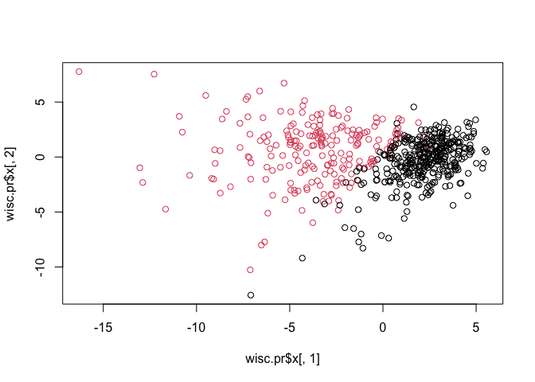
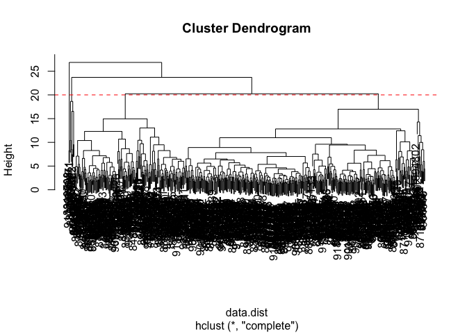
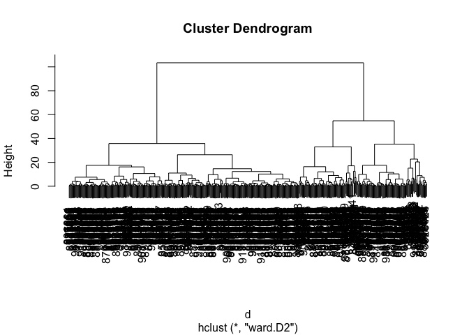
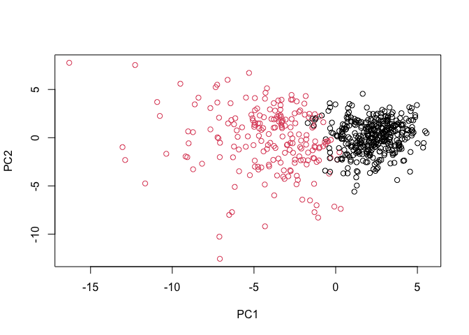
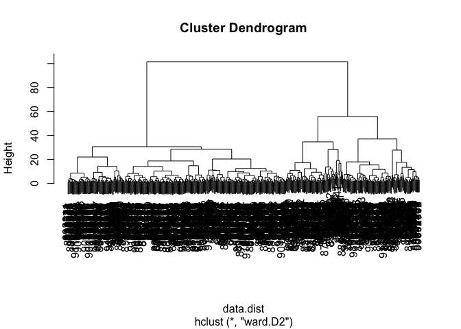

# Class 8 Mini Project: Unsupervised Learning Analysis of Human Breast
Cancer Cells
Isabel Hui - A16887852

## Introduction

It is important to consider scaling your data before analysis such as
PCA.

For example:

``` r
head(mtcars)
```

                       mpg cyl disp  hp drat    wt  qsec vs am gear carb
    Mazda RX4         21.0   6  160 110 3.90 2.620 16.46  0  1    4    4
    Mazda RX4 Wag     21.0   6  160 110 3.90 2.875 17.02  0  1    4    4
    Datsun 710        22.8   4  108  93 3.85 2.320 18.61  1  1    4    1
    Hornet 4 Drive    21.4   6  258 110 3.08 3.215 19.44  1  0    3    1
    Hornet Sportabout 18.7   8  360 175 3.15 3.440 17.02  0  0    3    2
    Valiant           18.1   6  225 105 2.76 3.460 20.22  1  0    3    1

``` r
colMeans(mtcars)
```

           mpg        cyl       disp         hp       drat         wt       qsec 
     20.090625   6.187500 230.721875 146.687500   3.596563   3.217250  17.848750 
            vs         am       gear       carb 
      0.437500   0.406250   3.687500   2.812500 

``` r
apply(mtcars, 2, sd)
```

            mpg         cyl        disp          hp        drat          wt 
      6.0269481   1.7859216 123.9386938  68.5628685   0.5346787   0.9784574 
           qsec          vs          am        gear        carb 
      1.7869432   0.5040161   0.4989909   0.7378041   1.6152000 

``` r
x <- scale(mtcars)
head(x)
```

                             mpg        cyl        disp         hp       drat
    Mazda RX4          0.1508848 -0.1049878 -0.57061982 -0.5350928  0.5675137
    Mazda RX4 Wag      0.1508848 -0.1049878 -0.57061982 -0.5350928  0.5675137
    Datsun 710         0.4495434 -1.2248578 -0.99018209 -0.7830405  0.4739996
    Hornet 4 Drive     0.2172534 -0.1049878  0.22009369 -0.5350928 -0.9661175
    Hornet Sportabout -0.2307345  1.0148821  1.04308123  0.4129422 -0.8351978
    Valiant           -0.3302874 -0.1049878 -0.04616698 -0.6080186 -1.5646078
                                wt       qsec         vs         am       gear
    Mazda RX4         -0.610399567 -0.7771651 -0.8680278  1.1899014  0.4235542
    Mazda RX4 Wag     -0.349785269 -0.4637808 -0.8680278  1.1899014  0.4235542
    Datsun 710        -0.917004624  0.4260068  1.1160357  1.1899014  0.4235542
    Hornet 4 Drive    -0.002299538  0.8904872  1.1160357 -0.8141431 -0.9318192
    Hornet Sportabout  0.227654255 -0.4637808 -0.8680278 -0.8141431 -0.9318192
    Valiant            0.248094592  1.3269868  1.1160357 -0.8141431 -0.9318192
                            carb
    Mazda RX4          0.7352031
    Mazda RX4 Wag      0.7352031
    Datsun 710        -1.1221521
    Hornet 4 Drive    -1.1221521
    Hornet Sportabout -0.5030337
    Valiant           -1.1221521

``` r
round(colMeans(x), 2)
```

     mpg  cyl disp   hp drat   wt qsec   vs   am gear carb 
       0    0    0    0    0    0    0    0    0    0    0 

## Mini-Project

``` r
fna.data <- "WisconsinCancer.csv"
```

``` r
wisc.df <- read.csv(fna.data, row.names=1)
#wisc.df
```

``` r
wisc.data <- wisc.df[,-1]
```

``` r
diagnosis <- wisc.df[,1]
table(diagnosis)
```

    diagnosis
      B   M 
    357 212 

Remove this first `diagnosis` column from the dataset since I don’t want
to pass this to PCA etc. It is essentially the expert “answer” that we
will compare our analysis results to.

*Exploratory Data Analysis*

> Q1. How many observations are in this dataset?

``` r
357 + 212
```

    [1] 569

> Q2. How many of the observations have a malignant diagnosis?

``` r
diagnosis <- wisc.df[,1]
table(diagnosis)
```

    diagnosis
      B   M 
    357 212 

> Q3. How many variables/features in the data are suffixed with \_mean?

``` r
length(grep("_mean", colnames(wisc.data)))
```

    [1] 10

## Principal Component Analysis (PCA)

``` r
wisc.pr <- prcomp(wisc.data, scale = T)
summary(wisc.pr)
```

    Importance of components:
                              PC1    PC2     PC3     PC4     PC5     PC6     PC7
    Standard deviation     3.6444 2.3857 1.67867 1.40735 1.28403 1.09880 0.82172
    Proportion of Variance 0.4427 0.1897 0.09393 0.06602 0.05496 0.04025 0.02251
    Cumulative Proportion  0.4427 0.6324 0.72636 0.79239 0.84734 0.88759 0.91010
                               PC8    PC9    PC10   PC11    PC12    PC13    PC14
    Standard deviation     0.69037 0.6457 0.59219 0.5421 0.51104 0.49128 0.39624
    Proportion of Variance 0.01589 0.0139 0.01169 0.0098 0.00871 0.00805 0.00523
    Cumulative Proportion  0.92598 0.9399 0.95157 0.9614 0.97007 0.97812 0.98335
                              PC15    PC16    PC17    PC18    PC19    PC20   PC21
    Standard deviation     0.30681 0.28260 0.24372 0.22939 0.22244 0.17652 0.1731
    Proportion of Variance 0.00314 0.00266 0.00198 0.00175 0.00165 0.00104 0.0010
    Cumulative Proportion  0.98649 0.98915 0.99113 0.99288 0.99453 0.99557 0.9966
                              PC22    PC23   PC24    PC25    PC26    PC27    PC28
    Standard deviation     0.16565 0.15602 0.1344 0.12442 0.09043 0.08307 0.03987
    Proportion of Variance 0.00091 0.00081 0.0006 0.00052 0.00027 0.00023 0.00005
    Cumulative Proportion  0.99749 0.99830 0.9989 0.99942 0.99969 0.99992 0.99997
                              PC29    PC30
    Standard deviation     0.02736 0.01153
    Proportion of Variance 0.00002 0.00000
    Cumulative Proportion  1.00000 1.00000

Main “PC Score plot”, “PC1 vs PC2 plot”

See what is in our PCA result objects:

``` r
attributes(wisc.pr)
```

    $names
    [1] "sdev"     "rotation" "center"   "scale"    "x"       

    $class
    [1] "prcomp"

``` r
head(wisc.pr$x)
```

                   PC1        PC2        PC3       PC4        PC5         PC6
    842302   -9.184755  -1.946870 -1.1221788 3.6305364  1.1940595  1.41018364
    842517   -2.385703   3.764859 -0.5288274 1.1172808 -0.6212284  0.02863116
    84300903 -5.728855   1.074229 -0.5512625 0.9112808  0.1769302  0.54097615
    84348301 -7.116691 -10.266556 -3.2299475 0.1524129  2.9582754  3.05073750
    84358402 -3.931842   1.946359  1.3885450 2.9380542 -0.5462667 -1.22541641
    843786   -2.378155  -3.946456 -2.9322967 0.9402096  1.0551135 -0.45064213
                     PC7         PC8         PC9       PC10       PC11       PC12
    842302    2.15747152  0.39805698 -0.15698023 -0.8766305 -0.2627243 -0.8582593
    842517    0.01334635 -0.24077660 -0.71127897  1.1060218 -0.8124048  0.1577838
    84300903 -0.66757908 -0.09728813  0.02404449  0.4538760  0.6050715  0.1242777
    84348301  1.42865363 -1.05863376 -1.40420412 -1.1159933  1.1505012  1.0104267
    84358402 -0.93538950 -0.63581661 -0.26357355  0.3773724 -0.6507870 -0.1104183
    843786    0.49001396  0.16529843 -0.13335576 -0.5299649 -0.1096698  0.0813699
                    PC13         PC14         PC15        PC16        PC17
    842302    0.10329677 -0.690196797  0.601264078  0.74446075 -0.26523740
    842517   -0.94269981 -0.652900844 -0.008966977 -0.64823831 -0.01719707
    84300903 -0.41026561  0.016665095 -0.482994760  0.32482472  0.19075064
    84348301 -0.93245070 -0.486988399  0.168699395  0.05132509  0.48220960
    84358402  0.38760691 -0.538706543 -0.310046684 -0.15247165  0.13302526
    843786   -0.02625135  0.003133944 -0.178447576 -0.01270566  0.19671335
                    PC18       PC19        PC20         PC21        PC22
    842302   -0.54907956  0.1336499  0.34526111  0.096430045 -0.06878939
    842517    0.31801756 -0.2473470 -0.11403274 -0.077259494  0.09449530
    84300903 -0.08789759 -0.3922812 -0.20435242  0.310793246  0.06025601
    84348301 -0.03584323 -0.0267241 -0.46432511  0.433811661  0.20308706
    84358402 -0.01869779  0.4610302  0.06543782 -0.116442469  0.01763433
    843786   -0.29727706 -0.1297265 -0.07117453 -0.002400178  0.10108043
                    PC23         PC24         PC25         PC26        PC27
    842302    0.08444429  0.175102213  0.150887294 -0.201326305 -0.25236294
    842517   -0.21752666 -0.011280193  0.170360355 -0.041092627  0.18111081
    84300903 -0.07422581 -0.102671419 -0.171007656  0.004731249  0.04952586
    84348301 -0.12399554 -0.153294780 -0.077427574 -0.274982822  0.18330078
    84358402  0.13933105  0.005327110 -0.003059371  0.039219780  0.03213957
    843786    0.03344819 -0.002837749 -0.122282765 -0.030272333 -0.08438081
                      PC28         PC29          PC30
    842302   -0.0338846387  0.045607590  0.0471277407
    842517    0.0325955021 -0.005682424  0.0018662342
    84300903  0.0469844833  0.003143131 -0.0007498749
    84348301  0.0424469831 -0.069233868  0.0199198881
    84358402 -0.0347556386  0.005033481 -0.0211951203
    843786    0.0007296587 -0.019703996 -0.0034564331

``` r
summary(wisc.pr)
```

    Importance of components:
                              PC1    PC2     PC3     PC4     PC5     PC6     PC7
    Standard deviation     3.6444 2.3857 1.67867 1.40735 1.28403 1.09880 0.82172
    Proportion of Variance 0.4427 0.1897 0.09393 0.06602 0.05496 0.04025 0.02251
    Cumulative Proportion  0.4427 0.6324 0.72636 0.79239 0.84734 0.88759 0.91010
                               PC8    PC9    PC10   PC11    PC12    PC13    PC14
    Standard deviation     0.69037 0.6457 0.59219 0.5421 0.51104 0.49128 0.39624
    Proportion of Variance 0.01589 0.0139 0.01169 0.0098 0.00871 0.00805 0.00523
    Cumulative Proportion  0.92598 0.9399 0.95157 0.9614 0.97007 0.97812 0.98335
                              PC15    PC16    PC17    PC18    PC19    PC20   PC21
    Standard deviation     0.30681 0.28260 0.24372 0.22939 0.22244 0.17652 0.1731
    Proportion of Variance 0.00314 0.00266 0.00198 0.00175 0.00165 0.00104 0.0010
    Cumulative Proportion  0.98649 0.98915 0.99113 0.99288 0.99453 0.99557 0.9966
                              PC22    PC23   PC24    PC25    PC26    PC27    PC28
    Standard deviation     0.16565 0.15602 0.1344 0.12442 0.09043 0.08307 0.03987
    Proportion of Variance 0.00091 0.00081 0.0006 0.00052 0.00027 0.00023 0.00005
    Cumulative Proportion  0.99749 0.99830 0.9989 0.99942 0.99969 0.99992 0.99997
                              PC29    PC30
    Standard deviation     0.02736 0.01153
    Proportion of Variance 0.00002 0.00000
    Cumulative Proportion  1.00000 1.00000

> Q4. From your results, what proportion of the original variance is
> captured by the first principal components (PC1)?

44.27% or 0.4427

> Q5. How many principal components (PCs) are required to describe at
> least 70% of the original variance in the data?

3 PCs are required (PC1-PC3) where the threshold is at 72.636%
(0.72636).

> Q6. How many principal components (PCs) are required to describe at
> least 90% of the original variance in the data?

7 PCs are required (PC1-PC7) where the threshold is at 91.010%
(0.91010).

``` r
#wisc.pr$x
plot(wisc.pr$x[,1], wisc.pr$x[,2], 
     col=as.factor(diagnosis))
```



``` r
biplot(wisc.pr)
```


> Q7. What stands out to you about this plot? Is it easy or difficult to
> understand? Why?

This plot is very difficult to understand because of all of the name
clustering. it is difficult to read with so much overlap.

> Q8. Generate a similar plot for principal components 1 and 3. What do
> you notice about these plots?

Compared to the prior plot of PC1 and PC2, this plot for PC1 and PC3
shows a weaker delineation between the clusters.

``` r
plot(wisc.pr$x[,1], wisc.pr$x[,3], col = as.factor(diagnosis), 
     xlab = "PC1", ylab = "PC3")
```


``` r
df <- as.data.frame(wisc.pr$x)
df$diagnosis <- diagnosis

library(ggplot2)

ggplot(df) + 
  aes(PC1, PC2, col=diagnosis) + 
  geom_point()
```


## Variance Explained

``` r
pr.var <- wisc.pr$sdev^2
head(pr.var)
```

    [1] 13.281608  5.691355  2.817949  1.980640  1.648731  1.207357

``` r
pve <- pr.var / sum(pr.var)

plot(pve, xlab = "Principal Component", 
     ylab = "Proportion of Variance Explained", 
     ylim = c(0, 1), type = "o")
```


``` r
barplot(pve, ylab = "Precent of Variance Explained",
     names.arg=paste0("PC",1:length(pve)), las=2, axes = FALSE)
axis(2, at=pve, labels=round(pve,2)*100 )
```


## Communicating PCA Results

> Q9. For the first principal component, what is the component of the
> loading vector (i.e. `wisc.pr$rotation[,1]`) for the feature
> `concave.points_mean`?

``` r
loading_vector <- wisc.pr$rotation["concave.points_mean",1]
loading_vector
```

    [1] -0.2608538

> Q10. What is the minimum number of principal components required to
> explain 80% of the variance of the data?

5 PCs are required (PC1-PC5) where the threshold is at 84.734%
(0.84734).

## Hierarchical Clustering

``` r
data.scaled <- scale(wisc.data)
```

``` r
data.dist <- dist(data.scaled)
```

``` r
wisc.hclust <- hclust(data.dist, "complete")
```

> Q11. Using the plot() and abline() functions, what is the height at
> which the clustering model has 4 clusters?

`h=20`

``` r
plot(wisc.hclust)
abline(h=20, col="red", lty=2)
```



## Selecting Number of Clusters

``` r
table(diagnosis)
```

    diagnosis
      B   M 
    357 212 

``` r
wisc.hclust.clusters <- cutree(wisc.hclust, k=4)
table(wisc.hclust.clusters, diagnosis)
```

                        diagnosis
    wisc.hclust.clusters   B   M
                       1  12 165
                       2   2   5
                       3 343  40
                       4   0   2

> Q13. Which method gives your favorite results for the same data.dist
> dataset? Explain your reasoning.

The PCA scatter plots are my preferred method because the visual seems
to be more clear. There is a lot more going on visually in a
hierarchical cluster, compared to the plots where clusters can be more
easily delineated from each other. It is much easier to interpret and
the coding parameters are, in my opinion, much simpler to understand.

## Combine PCA and Clustering

Out PCA results were in `wisc.pr$x`.

``` r
d <- dist(wisc.pr$x[,1:3])
hc <- hclust(d, method = "ward.D2")
plot(hc)
```



Cut tree into two groups/branches/clusters…

``` r
grps <- cutree(hc, k=2)
```

``` r
plot(wisc.pr$x, col=grps)
```


Compare my clustering results (my `grps`) to the expert `diagnosis`.

``` r
table(diagnosis)
```

    diagnosis
      B   M 
    357 212 

``` r
table(grps)
```

    grps
      1   2 
    203 366 

We can combine the two:

``` r
table(diagnosis, grps)
```

             grps
    diagnosis   1   2
            B  24 333
            M 179  33

``` r
plot(wisc.pr$x[,1:2], col=grps)
```


``` r
g <- as.factor(grps)
levels(g)
```

    [1] "1" "2"

``` r
g <- relevel(g,2)
levels(g)
```

    [1] "2" "1"

``` r
plot(wisc.pr$x[,1:2], col=g)
```



``` r
data.dist <- dist(wisc.pr$x[,1:7])
wisc.pr.hclust <- hclust(data.dist, method="ward.D2")
plot(wisc.pr.hclust)
```



``` r
wisc.pr.hclust.clusters <- cutree(wisc.pr.hclust, k=2)
table(wisc.pr.hclust.clusters, diagnosis)
```

                           diagnosis
    wisc.pr.hclust.clusters   B   M
                          1  28 188
                          2 329  24

> Q15. How well does the newly created model with four clusters separate
> out the two diagnoses?

This model separates the clusters relatively well but it could be
better–there is still a decent amount of outliers between the clusters,
but there is still a separation.

> Q16. How well do the k-means and hierarchical clustering models you
> created in previous sections (i.e. before PCA) do in terms of
> separating the diagnoses? Again, use the table() function to compare
> the output of each model (wisc.km\$cluster and wisc.hclust.clusters)
> with the vector containing the actual diagnoses.

The `wisc.km$cluster` is similarly decent at separating the clusters,
with good separation and some outliers. However, `wisc.hclust.clusters`
with more clusters is not as good at separating them, with the benign
and especially malignant data showing more dispersal.

``` r
wisc.km <- kmeans(scale(wisc.data), centers=2, nstart=20)
```

``` r
table(wisc.km$cluster, diagnosis)
```

       diagnosis
          B   M
      1  14 175
      2 343  37

``` r
table(wisc.hclust.clusters, diagnosis)
```

                        diagnosis
    wisc.hclust.clusters   B   M
                       1  12 165
                       2   2   5
                       3 343  40
                       4   0   2

## Prediction

``` r
#url <- "new_samples.csv"
url <- "https://tinyurl.com/new-samples-CSV"
new <- read.csv(url)
npc <- predict(wisc.pr, newdata=new)
npc
```

               PC1       PC2        PC3        PC4       PC5        PC6        PC7
    [1,]  2.576616 -3.135913  1.3990492 -0.7631950  2.781648 -0.8150185 -0.3959098
    [2,] -4.754928 -3.009033 -0.1660946 -0.6052952 -1.140698 -1.2189945  0.8193031
                PC8       PC9       PC10      PC11      PC12      PC13     PC14
    [1,] -0.2307350 0.1029569 -0.9272861 0.3411457  0.375921 0.1610764 1.187882
    [2,] -0.3307423 0.5281896 -0.4855301 0.7173233 -1.185917 0.5893856 0.303029
              PC15       PC16        PC17        PC18        PC19       PC20
    [1,] 0.3216974 -0.1743616 -0.07875393 -0.11207028 -0.08802955 -0.2495216
    [2,] 0.1299153  0.1448061 -0.40509706  0.06565549  0.25591230 -0.4289500
               PC21       PC22       PC23       PC24        PC25         PC26
    [1,]  0.1228233 0.09358453 0.08347651  0.1223396  0.02124121  0.078884581
    [2,] -0.1224776 0.01732146 0.06316631 -0.2338618 -0.20755948 -0.009833238
                 PC27        PC28         PC29         PC30
    [1,]  0.220199544 -0.02946023 -0.015620933  0.005269029
    [2,] -0.001134152  0.09638361  0.002795349 -0.019015820

``` r
plot(wisc.pr$x[,1:2], col=g)
points(npc[,1], npc[,2], col="blue", pch=16, cex=3)
text(npc[,1], npc[,2], c(1,2), col="white")
```


> Q18. Which of these new patients should we prioritize for follow up
> based on your results?

We should prioritize patient 1, where the clustering of malignant is
most apparent.
