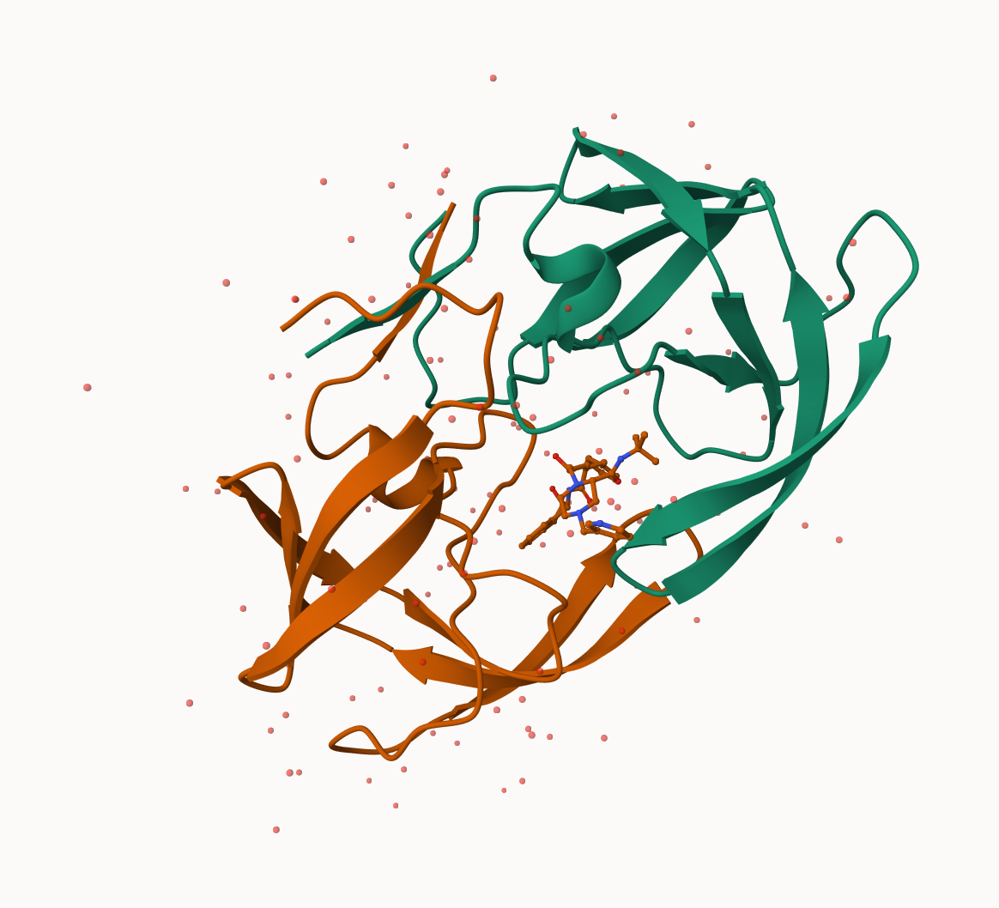
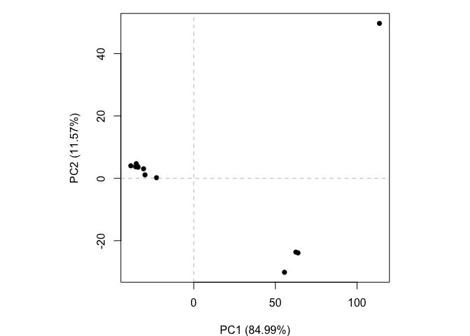

# Class 9: Structural Bioinformatives 1
Isabel Hui - A16887852

The main database for structural data is called the PDB (Protein Data
Bank). Let’s see what it contains:

Data from: https://www.rcsb.org/stats

Read this into R:

``` r
pdbdb <- read.csv("pdb_stats.csv")
pdbdb
```

               Molecular.Type   X.ray     EM    NMR Multiple.methods Neutron Other
    1          Protein (only) 167,192 15,572 12,529              208      77    32
    2 Protein/Oligosaccharide   9,639  2,635     34                8       2     0
    3              Protein/NA   8,730  4,697    286                7       0     0
    4     Nucleic acid (only)   2,869    137  1,507               14       3     1
    5                   Other     170     10     33                0       0     0
    6  Oligosaccharide (only)      11      0      6                1       0     4
        Total
    1 195,610
    2  12,318
    3  13,720
    4   4,531
    5     213
    6      22

> Q1: What percentage of structures in the PDB are solved by X-Ray and
> Electron Microscopy.

``` r
pdbdb$Total
```

    [1] "195,610" "12,318"  "13,720"  "4,531"   "213"     "22"     

I need to remove the comma and convert to numeric to do math:

``` r
as.numeric(sub(",", "", pdbdb$Total))
```

    [1] 195610  12318  13720   4531    213     22

I can also turn this into a fucntion to fix the whole table or any
future table I read like this:

``` r
x <- pdbdb$Total
as.numeric(sub(",", "", pdbdb$Total))
```

    [1] 195610  12318  13720   4531    213     22

``` r
comma2numeric <- function(x) {
  as.numeric(sub(",", "", pdbdb$Total))
}
```

Test it:

``` r
comma2numeric(pdbdb$X.ray)
```

    [1] 195610  12318  13720   4531    213     22

``` r
apply(pdbdb, 2, comma2numeric)
```

         Molecular.Type  X.ray     EM    NMR Multiple.methods Neutron  Other  Total
    [1,]         195610 195610 195610 195610           195610  195610 195610 195610
    [2,]          12318  12318  12318  12318            12318   12318  12318  12318
    [3,]          13720  13720  13720  13720            13720   13720  13720  13720
    [4,]           4531   4531   4531   4531             4531    4531   4531   4531
    [5,]            213    213    213    213              213     213    213    213
    [6,]             22     22     22     22               22      22     22     22

(Or try a different read/import function:)

``` r
#/ message: false

library(readr)
pdbdb <- read_csv("pdb_stats.csv")
```

    Rows: 6 Columns: 8
    ── Column specification ────────────────────────────────────────────────────────
    Delimiter: ","
    chr (1): Molecular Type
    dbl (3): Multiple methods, Neutron, Other
    num (4): X-ray, EM, NMR, Total

    ℹ Use `spec()` to retrieve the full column specification for this data.
    ℹ Specify the column types or set `show_col_types = FALSE` to quiet this message.

``` r
sum(pdbdb$Total)
```

    [1] 226414

For percentage of structures solved by X-ray and electromicroscopy (EM):

``` r
sum(pdbdb$`X-ray`)/sum(pdbdb$Total) * 100
```

    [1] 83.30359

``` r
sum(pdbdb$EM)/sum(pdbdb$Total) * 100
```

    [1] 10.18091

> Q2: What proportion of structures in the PDB are protein?

``` r
pdbdb$Total[1]/sum(pdbdb$Total) * 100
```

    [1] 86.39483

> Q3: Type HIV in the PDB website search box on the home page and
> determine how many HIV-1 protease structures are in the current PDB?

2,294

## Mol\*

Using the link: https://molstar.org/viewer/

We will use PDB code: *1HSG*



Some more custom images:

.png)

.png)

## Questions: The important role of water

> Q4: Water molecules normally have 3 atoms. Why do we see just one atom
> per water molecule in this structure?

This is because this makes the visual easier; a lot of this modeling
over-simplifies for the purpose of aesthetics and ease of understanding.

> Q5: There is a critical “conserved” water molecule in the binding
> site. Can you identify this water molecule? What residue number does
> this water molecule have

This “conserved” water molecule is HOH, water 400. It helps to stabilize
protein and ligand interactions.

> Q6: Generate and save a figure clearly showing the two distinct chains
> of HIV-protease along with the ligand. You might also consider showing
> the catalytic residues ASP 25 in each chain and the critical water (we
> recommend “Ball & Stick” for these side-chains). Add this figure to
> your Quarto document.

.png)

.png)

## The Bio3D Package

The bio3D package allows us to do all sorts of structural bioinformatics
work in R.

Let’s start with hw it can read these PDB files:

``` r
library(bio3d)

pdb <- read.pdb("1hsg")
```

      Note: Accessing on-line PDB file

``` r
pdb
```


     Call:  read.pdb(file = "1hsg")

       Total Models#: 1
         Total Atoms#: 1686,  XYZs#: 5058  Chains#: 2  (values: A B)

         Protein Atoms#: 1514  (residues/Calpha atoms#: 198)
         Nucleic acid Atoms#: 0  (residues/phosphate atoms#: 0)

         Non-protein/nucleic Atoms#: 172  (residues: 128)
         Non-protein/nucleic resid values: [ HOH (127), MK1 (1) ]

       Protein sequence:
          PQITLWQRPLVTIKIGGQLKEALLDTGADDTVLEEMSLPGRWKPKMIGGIGGFIKVRQYD
          QILIEICGHKAIGTVLVGPTPVNIIGRNLLTQIGCTLNFPQITLWQRPLVTIKIGGQLKE
          ALLDTGADDTVLEEMSLPGRWKPKMIGGIGGFIKVRQYDQILIEICGHKAIGTVLVGPTP
          VNIIGRNLLTQIGCTLNF

    + attr: atom, xyz, seqres, helix, sheet,
            calpha, remark, call

``` r
attributes(pdb)
```

    $names
    [1] "atom"   "xyz"    "seqres" "helix"  "sheet"  "calpha" "remark" "call"  

    $class
    [1] "pdb" "sse"

``` r
head(pdb$atom)
```

      type eleno elety  alt resid chain resno insert      x      y     z o     b
    1 ATOM     1     N <NA>   PRO     A     1   <NA> 29.361 39.686 5.862 1 38.10
    2 ATOM     2    CA <NA>   PRO     A     1   <NA> 30.307 38.663 5.319 1 40.62
    3 ATOM     3     C <NA>   PRO     A     1   <NA> 29.760 38.071 4.022 1 42.64
    4 ATOM     4     O <NA>   PRO     A     1   <NA> 28.600 38.302 3.676 1 43.40
    5 ATOM     5    CB <NA>   PRO     A     1   <NA> 30.508 37.541 6.342 1 37.87
    6 ATOM     6    CG <NA>   PRO     A     1   <NA> 29.296 37.591 7.162 1 38.40
      segid elesy charge
    1  <NA>     N   <NA>
    2  <NA>     C   <NA>
    3  <NA>     C   <NA>
    4  <NA>     O   <NA>
    5  <NA>     C   <NA>
    6  <NA>     C   <NA>

``` r
pdbseq(pdb)
```

      1   2   3   4   5   6   7   8   9  10  11  12  13  14  15  16  17  18  19  20 
    "P" "Q" "I" "T" "L" "W" "Q" "R" "P" "L" "V" "T" "I" "K" "I" "G" "G" "Q" "L" "K" 
     21  22  23  24  25  26  27  28  29  30  31  32  33  34  35  36  37  38  39  40 
    "E" "A" "L" "L" "D" "T" "G" "A" "D" "D" "T" "V" "L" "E" "E" "M" "S" "L" "P" "G" 
     41  42  43  44  45  46  47  48  49  50  51  52  53  54  55  56  57  58  59  60 
    "R" "W" "K" "P" "K" "M" "I" "G" "G" "I" "G" "G" "F" "I" "K" "V" "R" "Q" "Y" "D" 
     61  62  63  64  65  66  67  68  69  70  71  72  73  74  75  76  77  78  79  80 
    "Q" "I" "L" "I" "E" "I" "C" "G" "H" "K" "A" "I" "G" "T" "V" "L" "V" "G" "P" "T" 
     81  82  83  84  85  86  87  88  89  90  91  92  93  94  95  96  97  98  99   1 
    "P" "V" "N" "I" "I" "G" "R" "N" "L" "L" "T" "Q" "I" "G" "C" "T" "L" "N" "F" "P" 
      2   3   4   5   6   7   8   9  10  11  12  13  14  15  16  17  18  19  20  21 
    "Q" "I" "T" "L" "W" "Q" "R" "P" "L" "V" "T" "I" "K" "I" "G" "G" "Q" "L" "K" "E" 
     22  23  24  25  26  27  28  29  30  31  32  33  34  35  36  37  38  39  40  41 
    "A" "L" "L" "D" "T" "G" "A" "D" "D" "T" "V" "L" "E" "E" "M" "S" "L" "P" "G" "R" 
     42  43  44  45  46  47  48  49  50  51  52  53  54  55  56  57  58  59  60  61 
    "W" "K" "P" "K" "M" "I" "G" "G" "I" "G" "G" "F" "I" "K" "V" "R" "Q" "Y" "D" "Q" 
     62  63  64  65  66  67  68  69  70  71  72  73  74  75  76  77  78  79  80  81 
    "I" "L" "I" "E" "I" "C" "G" "H" "K" "A" "I" "G" "T" "V" "L" "V" "G" "P" "T" "P" 
     82  83  84  85  86  87  88  89  90  91  92  93  94  95  96  97  98  99 
    "V" "N" "I" "I" "G" "R" "N" "L" "L" "T" "Q" "I" "G" "C" "T" "L" "N" "F" 

> Q7: How many amino acid residues are there in this pdb object?

There is one calpha per amino acid, so counting the calpha gives us:

``` r
sum(pdb$calpha)
```

    [1] 198

Can also count the length of items in pdb:

``` r
length(pdbseq(pdb))
```

    [1] 198

> Q8: Name one of the two non-protein residues?

HOH and MK1

> Q9: How many protein chains are in this structure?

2

``` r
unique(pdb$atom$chain)
```

    [1] "A" "B"

## Predicting Functional Motions of a Single Structure

Let’s do a bioinformatics prediction of functional motions - i.e., the
movements that one of these molecules needs to make to do its stuff.

``` r
adk <- read.pdb("6s36")
```

      Note: Accessing on-line PDB file
       PDB has ALT records, taking A only, rm.alt=TRUE

``` r
adk
```


     Call:  read.pdb(file = "6s36")

       Total Models#: 1
         Total Atoms#: 1898,  XYZs#: 5694  Chains#: 1  (values: A)

         Protein Atoms#: 1654  (residues/Calpha atoms#: 214)
         Nucleic acid Atoms#: 0  (residues/phosphate atoms#: 0)

         Non-protein/nucleic Atoms#: 244  (residues: 244)
         Non-protein/nucleic resid values: [ CL (3), HOH (238), MG (2), NA (1) ]

       Protein sequence:
          MRIILLGAPGAGKGTQAQFIMEKYGIPQISTGDMLRAAVKSGSELGKQAKDIMDAGKLVT
          DELVIALVKERIAQEDCRNGFLLDGFPRTIPQADAMKEAGINVDYVLEFDVPDELIVDKI
          VGRRVHAPSGRVYHVKFNPPKVEGKDDVTGEELTTRKDDQEETVRKRLVEYHQMTAPLIG
          YYSKEAEAGNTKYAKVDGTKPVAEVRADLEKILG

    + attr: atom, xyz, seqres, helix, sheet,
            calpha, remark, call

``` r
# Perform flexibility prediction

m <- nma(adk)
```

     Building Hessian...        Done in 0.014 seconds.
     Diagonalizing Hessian...   Done in 0.289 seconds.

``` r
plot(m)
```


Write out multi-model PDB file (trajectory) that we can use to make an
animation of the predicted motions.

``` r
mktrj(m, file="adk.pdb")
```

I can open this in Mol\* to play the trajectory…

## Comparative Analysis of Protein Structures

``` r
library(bio3d)
```

Here we will find and analyze all ADK structures in the PDB database.

We will start with a single database accession ID: “1ake_A”

``` r
id <- "1ake_A"
aa <- get.seq(id)
```

    Warning in get.seq(id): Removing existing file: seqs.fasta

    Fetching... Please wait. Done.

I ran these in the R brain/console: install.packages(“BiocManager”)
BiocManager::install(“msa”)

> Q10. Which of the packages above is found only on BioConductor and not
> CRAN?

The `msa` package is from BioConductor/

> Q13. How many amino acids are in this sequence, i.e. how long is this
> sequence?

``` r
length(aa)
```

    [1] 3

``` r
attributes(aa)
```

    $names
    [1] "id"   "ali"  "call"

    $class
    [1] "fasta"

``` r
ncol(aa$ali)
```

    [1] 214

``` r
#b <- blast.pdb(aa)
#hits <- plot(b)
#head(hits$pdb.id)
```

Pre-calculated results:

``` r
hits <- NULL
hits$pdb.id <- c('1AKE_A','6S36_A','6RZE_A','3HPR_A','1E4V_A','5EJE_A','1E4Y_A','3X2S_A','6HAP_A','6HAM_A','4K46_A','3GMT_A','4PZL_A')
```

``` r
files <- get.pdb(hits$pdb.id, path="pdbs", split=TRUE, gzip=TRUE)
```

    Warning in get.pdb(hits$pdb.id, path = "pdbs", split = TRUE, gzip = TRUE):
    pdbs/1AKE.pdb.gz exists. Skipping download

    Warning in get.pdb(hits$pdb.id, path = "pdbs", split = TRUE, gzip = TRUE):
    pdbs/6S36.pdb.gz exists. Skipping download

    Warning in get.pdb(hits$pdb.id, path = "pdbs", split = TRUE, gzip = TRUE):
    pdbs/6RZE.pdb.gz exists. Skipping download

    Warning in get.pdb(hits$pdb.id, path = "pdbs", split = TRUE, gzip = TRUE):
    pdbs/3HPR.pdb.gz exists. Skipping download

    Warning in get.pdb(hits$pdb.id, path = "pdbs", split = TRUE, gzip = TRUE):
    pdbs/1E4V.pdb.gz exists. Skipping download

    Warning in get.pdb(hits$pdb.id, path = "pdbs", split = TRUE, gzip = TRUE):
    pdbs/5EJE.pdb.gz exists. Skipping download

    Warning in get.pdb(hits$pdb.id, path = "pdbs", split = TRUE, gzip = TRUE):
    pdbs/1E4Y.pdb.gz exists. Skipping download

    Warning in get.pdb(hits$pdb.id, path = "pdbs", split = TRUE, gzip = TRUE):
    pdbs/3X2S.pdb.gz exists. Skipping download

    Warning in get.pdb(hits$pdb.id, path = "pdbs", split = TRUE, gzip = TRUE):
    pdbs/6HAP.pdb.gz exists. Skipping download

    Warning in get.pdb(hits$pdb.id, path = "pdbs", split = TRUE, gzip = TRUE):
    pdbs/6HAM.pdb.gz exists. Skipping download

    Warning in get.pdb(hits$pdb.id, path = "pdbs", split = TRUE, gzip = TRUE):
    pdbs/4K46.pdb.gz exists. Skipping download

    Warning in get.pdb(hits$pdb.id, path = "pdbs", split = TRUE, gzip = TRUE):
    pdbs/3GMT.pdb.gz exists. Skipping download

    Warning in get.pdb(hits$pdb.id, path = "pdbs", split = TRUE, gzip = TRUE):
    pdbs/4PZL.pdb.gz exists. Skipping download


      |                                                                            
      |                                                                      |   0%
      |                                                                            
      |=====                                                                 |   8%
      |                                                                            
      |===========                                                           |  15%
      |                                                                            
      |================                                                      |  23%
      |                                                                            
      |======================                                                |  31%
      |                                                                            
      |===========================                                           |  38%
      |                                                                            
      |================================                                      |  46%
      |                                                                            
      |======================================                                |  54%
      |                                                                            
      |===========================================                           |  62%
      |                                                                            
      |================================================                      |  69%
      |                                                                            
      |======================================================                |  77%
      |                                                                            
      |===========================================================           |  85%
      |                                                                            
      |=================================================================     |  92%
      |                                                                            
      |======================================================================| 100%

Next we will use the pdbaln() function to align and also optionally fit
(i.e. superpose) the identified PDB structures.

``` r
pdbs <- pdbaln(files, fit = TRUE, exefile="msa")
```

    Reading PDB files:
    pdbs/split_chain/1AKE_A.pdb
    pdbs/split_chain/6S36_A.pdb
    pdbs/split_chain/6RZE_A.pdb
    pdbs/split_chain/3HPR_A.pdb
    pdbs/split_chain/1E4V_A.pdb
    pdbs/split_chain/5EJE_A.pdb
    pdbs/split_chain/1E4Y_A.pdb
    pdbs/split_chain/3X2S_A.pdb
    pdbs/split_chain/6HAP_A.pdb
    pdbs/split_chain/6HAM_A.pdb
    pdbs/split_chain/4K46_A.pdb
    pdbs/split_chain/3GMT_A.pdb
    pdbs/split_chain/4PZL_A.pdb
       PDB has ALT records, taking A only, rm.alt=TRUE
    .   PDB has ALT records, taking A only, rm.alt=TRUE
    .   PDB has ALT records, taking A only, rm.alt=TRUE
    .   PDB has ALT records, taking A only, rm.alt=TRUE
    ..   PDB has ALT records, taking A only, rm.alt=TRUE
    ....   PDB has ALT records, taking A only, rm.alt=TRUE
    .   PDB has ALT records, taking A only, rm.alt=TRUE
    ...

    Extracting sequences

    pdb/seq: 1   name: pdbs/split_chain/1AKE_A.pdb 
       PDB has ALT records, taking A only, rm.alt=TRUE
    pdb/seq: 2   name: pdbs/split_chain/6S36_A.pdb 
       PDB has ALT records, taking A only, rm.alt=TRUE
    pdb/seq: 3   name: pdbs/split_chain/6RZE_A.pdb 
       PDB has ALT records, taking A only, rm.alt=TRUE
    pdb/seq: 4   name: pdbs/split_chain/3HPR_A.pdb 
       PDB has ALT records, taking A only, rm.alt=TRUE
    pdb/seq: 5   name: pdbs/split_chain/1E4V_A.pdb 
    pdb/seq: 6   name: pdbs/split_chain/5EJE_A.pdb 
       PDB has ALT records, taking A only, rm.alt=TRUE
    pdb/seq: 7   name: pdbs/split_chain/1E4Y_A.pdb 
    pdb/seq: 8   name: pdbs/split_chain/3X2S_A.pdb 
    pdb/seq: 9   name: pdbs/split_chain/6HAP_A.pdb 
    pdb/seq: 10   name: pdbs/split_chain/6HAM_A.pdb 
       PDB has ALT records, taking A only, rm.alt=TRUE
    pdb/seq: 11   name: pdbs/split_chain/4K46_A.pdb 
       PDB has ALT records, taking A only, rm.alt=TRUE
    pdb/seq: 12   name: pdbs/split_chain/3GMT_A.pdb 
    pdb/seq: 13   name: pdbs/split_chain/4PZL_A.pdb 

``` r
pdbs
```

                                    1        .         .         .         40 
    [Truncated_Name:1]1AKE_A.pdb    ----------MRIILLGAPGAGKGTQAQFIMEKYGIPQIS
    [Truncated_Name:2]6S36_A.pdb    ----------MRIILLGAPGAGKGTQAQFIMEKYGIPQIS
    [Truncated_Name:3]6RZE_A.pdb    ----------MRIILLGAPGAGKGTQAQFIMEKYGIPQIS
    [Truncated_Name:4]3HPR_A.pdb    ----------MRIILLGAPGAGKGTQAQFIMEKYGIPQIS
    [Truncated_Name:5]1E4V_A.pdb    ----------MRIILLGAPVAGKGTQAQFIMEKYGIPQIS
    [Truncated_Name:6]5EJE_A.pdb    ----------MRIILLGAPGAGKGTQAQFIMEKYGIPQIS
    [Truncated_Name:7]1E4Y_A.pdb    ----------MRIILLGALVAGKGTQAQFIMEKYGIPQIS
    [Truncated_Name:8]3X2S_A.pdb    ----------MRIILLGAPGAGKGTQAQFIMEKYGIPQIS
    [Truncated_Name:9]6HAP_A.pdb    ----------MRIILLGAPGAGKGTQAQFIMEKYGIPQIS
    [Truncated_Name:10]6HAM_A.pdb   ----------MRIILLGAPGAGKGTQAQFIMEKYGIPQIS
    [Truncated_Name:11]4K46_A.pdb   ----------MRIILLGAPGAGKGTQAQFIMAKFGIPQIS
    [Truncated_Name:12]3GMT_A.pdb   ----------MRLILLGAPGAGKGTQANFIKEKFGIPQIS
    [Truncated_Name:13]4PZL_A.pdb   TENLYFQSNAMRIILLGAPGAGKGTQAKIIEQKYNIAHIS
                                              **^*****  *******  *  *^ *  ** 
                                    1        .         .         .         40 

                                   41        .         .         .         80 
    [Truncated_Name:1]1AKE_A.pdb    TGDMLRAAVKSGSELGKQAKDIMDAGKLVTDELVIALVKE
    [Truncated_Name:2]6S36_A.pdb    TGDMLRAAVKSGSELGKQAKDIMDAGKLVTDELVIALVKE
    [Truncated_Name:3]6RZE_A.pdb    TGDMLRAAVKSGSELGKQAKDIMDAGKLVTDELVIALVKE
    [Truncated_Name:4]3HPR_A.pdb    TGDMLRAAVKSGSELGKQAKDIMDAGKLVTDELVIALVKE
    [Truncated_Name:5]1E4V_A.pdb    TGDMLRAAVKSGSELGKQAKDIMDAGKLVTDELVIALVKE
    [Truncated_Name:6]5EJE_A.pdb    TGDMLRAAVKSGSELGKQAKDIMDACKLVTDELVIALVKE
    [Truncated_Name:7]1E4Y_A.pdb    TGDMLRAAVKSGSELGKQAKDIMDAGKLVTDELVIALVKE
    [Truncated_Name:8]3X2S_A.pdb    TGDMLRAAVKSGSELGKQAKDIMDCGKLVTDELVIALVKE
    [Truncated_Name:9]6HAP_A.pdb    TGDMLRAAVKSGSELGKQAKDIMDAGKLVTDELVIALVRE
    [Truncated_Name:10]6HAM_A.pdb   TGDMLRAAIKSGSELGKQAKDIMDAGKLVTDEIIIALVKE
    [Truncated_Name:11]4K46_A.pdb   TGDMLRAAIKAGTELGKQAKSVIDAGQLVSDDIILGLVKE
    [Truncated_Name:12]3GMT_A.pdb   TGDMLRAAVKAGTPLGVEAKTYMDEGKLVPDSLIIGLVKE
    [Truncated_Name:13]4PZL_A.pdb   TGDMIRETIKSGSALGQELKKVLDAGELVSDEFIIKIVKD
                                    ****^*  ^* *^ **   *  ^*   ** *  ^^ ^*^^ 
                                   41        .         .         .         80 

                                   81        .         .         .         120 
    [Truncated_Name:1]1AKE_A.pdb    RIAQEDCRNGFLLDGFPRTIPQADAMKEAGINVDYVLEFD
    [Truncated_Name:2]6S36_A.pdb    RIAQEDCRNGFLLDGFPRTIPQADAMKEAGINVDYVLEFD
    [Truncated_Name:3]6RZE_A.pdb    RIAQEDCRNGFLLDGFPRTIPQADAMKEAGINVDYVLEFD
    [Truncated_Name:4]3HPR_A.pdb    RIAQEDCRNGFLLDGFPRTIPQADAMKEAGINVDYVLEFD
    [Truncated_Name:5]1E4V_A.pdb    RIAQEDCRNGFLLDGFPRTIPQADAMKEAGINVDYVLEFD
    [Truncated_Name:6]5EJE_A.pdb    RIAQEDCRNGFLLDGFPRTIPQADAMKEAGINVDYVLEFD
    [Truncated_Name:7]1E4Y_A.pdb    RIAQEDCRNGFLLDGFPRTIPQADAMKEAGINVDYVLEFD
    [Truncated_Name:8]3X2S_A.pdb    RIAQEDSRNGFLLDGFPRTIPQADAMKEAGINVDYVLEFD
    [Truncated_Name:9]6HAP_A.pdb    RICQEDSRNGFLLDGFPRTIPQADAMKEAGINVDYVLEFD
    [Truncated_Name:10]6HAM_A.pdb   RICQEDSRNGFLLDGFPRTIPQADAMKEAGINVDYVLEFD
    [Truncated_Name:11]4K46_A.pdb   RIAQDDCAKGFLLDGFPRTIPQADGLKEVGVVVDYVIEFD
    [Truncated_Name:12]3GMT_A.pdb   RLKEADCANGYLFDGFPRTIAQADAMKEAGVAIDYVLEID
    [Truncated_Name:13]4PZL_A.pdb   RISKNDCNNGFLLDGVPRTIPQAQELDKLGVNIDYIVEVD
                                    *^   *   *^* ** **** **  ^   *^ ^**^^* * 
                                   81        .         .         .         120 

                                  121        .         .         .         160 
    [Truncated_Name:1]1AKE_A.pdb    VPDELIVDRIVGRRVHAPSGRVYHVKFNPPKVEGKDDVTG
    [Truncated_Name:2]6S36_A.pdb    VPDELIVDKIVGRRVHAPSGRVYHVKFNPPKVEGKDDVTG
    [Truncated_Name:3]6RZE_A.pdb    VPDELIVDAIVGRRVHAPSGRVYHVKFNPPKVEGKDDVTG
    [Truncated_Name:4]3HPR_A.pdb    VPDELIVDRIVGRRVHAPSGRVYHVKFNPPKVEGKDDGTG
    [Truncated_Name:5]1E4V_A.pdb    VPDELIVDRIVGRRVHAPSGRVYHVKFNPPKVEGKDDVTG
    [Truncated_Name:6]5EJE_A.pdb    VPDELIVDRIVGRRVHAPSGRVYHVKFNPPKVEGKDDVTG
    [Truncated_Name:7]1E4Y_A.pdb    VPDELIVDRIVGRRVHAPSGRVYHVKFNPPKVEGKDDVTG
    [Truncated_Name:8]3X2S_A.pdb    VPDELIVDRIVGRRVHAPSGRVYHVKFNPPKVEGKDDVTG
    [Truncated_Name:9]6HAP_A.pdb    VPDELIVDRIVGRRVHAPSGRVYHVKFNPPKVEGKDDVTG
    [Truncated_Name:10]6HAM_A.pdb   VPDELIVDRIVGRRVHAPSGRVYHVKFNPPKVEGKDDVTG
    [Truncated_Name:11]4K46_A.pdb   VADSVIVERMAGRRAHLASGRTYHNVYNPPKVEGKDDVTG
    [Truncated_Name:12]3GMT_A.pdb   VPFSEIIERMSGRRTHPASGRTYHVKFNPPKVEGKDDVTG
    [Truncated_Name:13]4PZL_A.pdb   VADNLLIERITGRRIHPASGRTYHTKFNPPKVADKDDVTG
                                    *    ^^^ ^ *** *  *** **  ^*****  *** ** 
                                  121        .         .         .         160 

                                  161        .         .         .         200 
    [Truncated_Name:1]1AKE_A.pdb    EELTTRKDDQEETVRKRLVEYHQMTAPLIGYYSKEAEAGN
    [Truncated_Name:2]6S36_A.pdb    EELTTRKDDQEETVRKRLVEYHQMTAPLIGYYSKEAEAGN
    [Truncated_Name:3]6RZE_A.pdb    EELTTRKDDQEETVRKRLVEYHQMTAPLIGYYSKEAEAGN
    [Truncated_Name:4]3HPR_A.pdb    EELTTRKDDQEETVRKRLVEYHQMTAPLIGYYSKEAEAGN
    [Truncated_Name:5]1E4V_A.pdb    EELTTRKDDQEETVRKRLVEYHQMTAPLIGYYSKEAEAGN
    [Truncated_Name:6]5EJE_A.pdb    EELTTRKDDQEECVRKRLVEYHQMTAPLIGYYSKEAEAGN
    [Truncated_Name:7]1E4Y_A.pdb    EELTTRKDDQEETVRKRLVEYHQMTAPLIGYYSKEAEAGN
    [Truncated_Name:8]3X2S_A.pdb    EELTTRKDDQEETVRKRLCEYHQMTAPLIGYYSKEAEAGN
    [Truncated_Name:9]6HAP_A.pdb    EELTTRKDDQEETVRKRLVEYHQMTAPLIGYYSKEAEAGN
    [Truncated_Name:10]6HAM_A.pdb   EELTTRKDDQEETVRKRLVEYHQMTAPLIGYYSKEAEAGN
    [Truncated_Name:11]4K46_A.pdb   EDLVIREDDKEETVLARLGVYHNQTAPLIAYYGKEAEAGN
    [Truncated_Name:12]3GMT_A.pdb   EPLVQRDDDKEETVKKRLDVYEAQTKPLITYYGDWARRGA
    [Truncated_Name:13]4PZL_A.pdb   EPLITRTDDNEDTVKQRLSVYHAQTAKLIDFYRNFSSTNT
                                    * *  * ** *^ *  **  *   *  ** ^*         
                                  161        .         .         .         200 

                                  201        .         .      227 
    [Truncated_Name:1]1AKE_A.pdb    T--KYAKVDGTKPVAEVRADLEKILG-
    [Truncated_Name:2]6S36_A.pdb    T--KYAKVDGTKPVAEVRADLEKILG-
    [Truncated_Name:3]6RZE_A.pdb    T--KYAKVDGTKPVAEVRADLEKILG-
    [Truncated_Name:4]3HPR_A.pdb    T--KYAKVDGTKPVAEVRADLEKILG-
    [Truncated_Name:5]1E4V_A.pdb    T--KYAKVDGTKPVAEVRADLEKILG-
    [Truncated_Name:6]5EJE_A.pdb    T--KYAKVDGTKPVAEVRADLEKILG-
    [Truncated_Name:7]1E4Y_A.pdb    T--KYAKVDGTKPVAEVRADLEKILG-
    [Truncated_Name:8]3X2S_A.pdb    T--KYAKVDGTKPVAEVRADLEKILG-
    [Truncated_Name:9]6HAP_A.pdb    T--KYAKVDGTKPVCEVRADLEKILG-
    [Truncated_Name:10]6HAM_A.pdb   T--KYAKVDGTKPVCEVRADLEKILG-
    [Truncated_Name:11]4K46_A.pdb   T--QYLKFDGTKAVAEVSAELEKALA-
    [Truncated_Name:12]3GMT_A.pdb   E-------NGLKAPA-----YRKISG-
    [Truncated_Name:13]4PZL_A.pdb   KIPKYIKINGDQAVEKVSQDIFDQLNK
                                             *                  
                                  201        .         .      227 

    Call:
      pdbaln(files = files, fit = TRUE, exefile = "msa")

    Class:
      pdbs, fasta

    Alignment dimensions:
      13 sequence rows; 227 position columns (204 non-gap, 23 gap) 

    + attr: xyz, resno, b, chain, id, ali, resid, sse, call

## Principal Component Analysis

``` r
pc.xray <- pca(pdbs)
plot(pc.xray)
```


To visualize the major structural variations in the ensemble the
function mktrj() can be used to generate a trajectory PDB file by
interpolating along a give PC (eigenvector):

``` r
pc1 <- mktrj(pc.xray, pc=1, file="pc_1.pdb")
```

``` r
pc.xray <- pca(pdbs)
```

``` r
plot(pc.xray, pc.axes = c(1,2))
```



``` r
uniprot <- 248838887
pdb <- 195610

pdb/uniprot *100
```

    [1] 0.0786091
